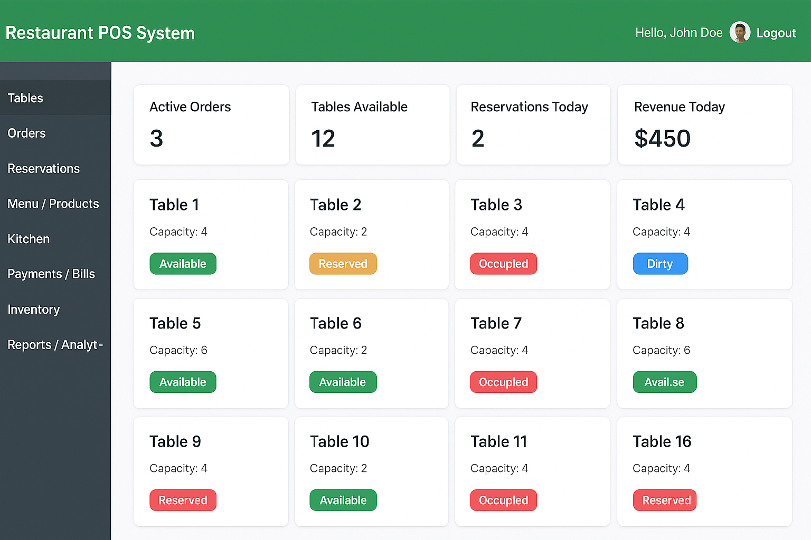

# 🍽️ Restaurant POS System  


A full-featured **Restaurant Point of Sale (POS)** system built with **NestJS (Backend)**, **Next.js (Frontend)**, and **PostgreSQL (Database)**.  
The system supports **staff management, table management, menu & orders, billing & payments, kitchen display system (KDS), inventory, analytics, and advanced features** like QR code ordering, loyalty programs, and hotel integration.  

---

## 🚀 Tech Stack
- **Backend**: NestJS + PostgreSQL (TypeORM / Prisma / Sequelize)  
- **Frontend**: Next.js (React, TypeScript)  
- **Real-time**: WebSockets / Socket.IO  
- **Authentication**: JWT + RBAC (Role-Based Access Control)  

---

## 📐 Project Architecture

### Backend (NestJS + PostgreSQL)
**Modules:**
- `Auth` → JWT, Roles, Permissions  
- `User` → Staff Management (Admin, Waiter, Cashier, Kitchen Staff)  
- `Table` → Table CRUD, Reservations  
- `Menu` → Products, Categories, Combos, Add-ons  
- `Order` → Dine-in, Takeaway, Delivery Orders  
- `Payment` → Billing, Taxes, Discounts, Receipts  
- `Kitchen` → KDS, Order Tracking  
- `Inventory` → Stock, Ingredients, Purchases  
- `Report` → Sales, Analytics  
- `Hotel` → (Optional Plugin for Hotel Integration)  

### Frontend (Next.js)
**Interfaces:**
- **Admin Panel**  
  - Dashboard (sales, performance)  
  - Staff Management  
  - Menu & Inventory  
  - Reports & Analytics  

- **POS Interface**  
  - Table Grid View  
  - Order Screen (add items, assign waiter)  
  - Payment Screen  
  - Reservation Screen  
  - Kitchen Display (KDS)  
  - Customer Self-Ordering (QR code menu)  

---

## 📋 Features

### 👨‍🍳 Staff & User Management
- Roles: **Admin, Waiter, Cashier, Kitchen Staff, Manager**  
- CRUD for staff accounts  
- Assign waiters to tables & kitchen staff to order types  
- Attendance & shift management (optional)  

### 🍽️ Table Management
- Create/manage tables (number, capacity, zone)  
- Table statuses: **Available, Occupied, Reserved, Dirty**  
- Assign waiter → table  
- Reservation system (customer name, phone, time)  
- Auto-clean/free table after order completion  

### 🧾 Menu & Product Management
- Categories (Appetizers, Drinks, Main Course, etc.)  
- Products (name, price, cost, description, image, availability)  
- Combo Meals / Packages / Set Menus  
- Add-ons & Modifiers (extra cheese, toppings)  
- Pricing rules (happy hour discounts, promotions)  

### 📦 Order Management
- Create/Update Orders  
- Transfer & Split Orders  
- Kitchen Order Ticket (KOT) auto-sent to kitchen  
- Order Types: **Dine-in, Takeaway, Delivery**  

### 💳 Billing & Payments
- Multiple payment methods: Cash, Card, Mobile Wallet  
- Split bill per item or person  
- Discounts, coupons, taxes, service charges  
- Generate receipts (Print/PDF/Email)  
- Refunds / Order cancellations  

### 🔥 Kitchen Management (KDS)
- Kitchen Display System (separate screen)  
- Track order status → Pending → Cooking → Ready → Served  
- Auto-routing: Drinks → Bar, Food → Kitchen  
- Notifications when order ready  

### 📦 Inventory & Stock
- Ingredients & recipe-based stock deduction  
- Purchase management (suppliers, invoices)  
- Low stock alerts  
- Wastage/returns tracking  

### 🛎️ Front Desk / Reservations
- Customer reservations (walk-in, phone, online)  
- Table allocation & queue management  
- Customer preferences (VIP, allergies, notes)  

### 📊 Reports & Analytics
- Daily, weekly, monthly sales  
- Waiter & kitchen performance  
- Table utilization  
- Inventory usage/wastage  
- Profit & loss, best-selling items  

### 🔗 Advanced Features
- QR Code Ordering (scan table QR → order directly)  
- Loyalty Program (points, discounts)  
- Multi-branch Management  
- Offline Mode (cache orders, sync when online)  
- Mobile App for Waiters (tablet/phone ordering)  
- Hotel Integration (room → table/order, sync bills)  

---

## 🛠️ Development Roadmap

### 📍 Phase 1: Foundation (Core Setup)
- ✅ Setup NestJS + PostgreSQL  
- ✅ Setup Next.js frontend  
- ✅ Auth & RBAC with JWT + Refresh Token  
- ✅ Basic Admin Dashboard  

### 📍 Phase 2: Staff & Table Management
- Staff CRUD & role assignment  
- Table CRUD + statuses (Available, Reserved, Dirty, Occupied)  
- Reservation system  

### 📍 Phase 3: Menu & Product Management
- Categories & products CRUD  
- Add-ons, modifiers, combo meals  
- POS menu display  

### 📍 Phase 4: Order Management
- Order creation & update  
- Split/transfer orders  
- Kitchen Order Tickets (KOT)  

### 📍 Phase 5: Kitchen Management (KDS)
- Kitchen display screen  
- Order status flow (Pending → Cooking → Ready → Served)  

### 📍 Phase 6: Billing & Payments
- Taxes, service charges, discounts  
- Multiple payment methods  
- Split bills, receipts, refunds  

### 📍 Phase 7: Inventory & Stock
- Recipe-based stock deduction  
- Supplier management  
- Low stock alerts, wastage tracking  

### 📍 Phase 8: Reports & Analytics
- Sales, staff performance, table utilization  
- Inventory usage & wastage  
- Profit & loss reports  

### 📍 Phase 9: Advanced Features
- QR ordering, loyalty, multi-branch  
- Offline mode, mobile apps  
- Hotel integration  

 

## 🍽️ NestJS project structure with modules

```lua
/restaurant-pos
 ├── src
 │   ├── app.module.ts
 │   ├── main.ts
 │   │
 │   ├── modules
 │   │    ├── tables
 │   │    │    ├── tables.module.ts
 │   │    │    ├── tables.controller.ts
 │   │    │    ├── tables.service.ts
 │   │    │    └── entities/table.entity.ts
 │   │    │
 │   │    ├── waiters
 │   │    │    ├── waiters.module.ts
 │   │    │    ├── waiters.controller.ts
 │   │    │    ├── waiters.service.ts
 │   │    │    └── entities/waiter.entity.ts
 │   │    │
 │   │    ├── menu
 │   │    │    ├── menu.module.ts
 │   │    │    ├── menu.controller.ts
 │   │    │    ├── menu.service.ts
 │   │    │    └── entities/menu-item.entity.ts
 │   │    │
 │   │    ├── orders
 │   │    │    ├── orders.module.ts
 │   │    │    ├── orders.controller.ts
 │   │    │    ├── orders.service.ts
 │   │    │    └── entities/order.entity.ts
 │   │    │
 │   │    ├── packages
 │   │    │    ├── packages.module.ts
 │   │    │    ├── packages.controller.ts
 │   │    │    ├── packages.service.ts
 │   │    │    └── entities/package.entity.ts
 │   │    │
 │   │    ├── reservations   # Hotel reservation plugin
 │   │    │    ├── reservations.module.ts
 │   │    │    ├── reservations.controller.ts
 │   │    │    ├── reservations.service.ts
 │   │    │    └── entities/reservation.entity.ts
 │   │    │
 │   │    ├── kitchen
 │   │    │    ├── kitchen.module.ts
 │   │    │    ├── kitchen.controller.ts
 │   │    │    ├── kitchen.service.ts
 │   │    │    └── entities/kitchen.entity.ts
 │   │    │
 │   │    ├── frontdesk
 │   │    │    ├── frontdesk.module.ts
 │   │    │    ├── frontdesk.controller.ts
 │   │    │    ├── frontdesk.service.ts
 │   │    │    └── entities/frontdesk.entity.ts
 │   │
 │   ├── common   # shared utils, DTOs, decorators
 │   │    ├── dto
 │   │    ├── guards
 │   │    └── interceptors
 │   │
 │   └── config
 │        └── typeorm.config.ts
 │
 ├── package.json
 ├── tsconfig.json
 └── nest-cli.json

```
# 🍽️ Restaurant POS – Database Schema & Modules

A complete **Restaurant Point of Sale (POS) System** design covering **Database Schema (ERD), NestJS TypeORM Entities, APIs, and Frontend Modules**.

This project aims to manage restaurants efficiently with **User Roles, Table Management, Menu, Orders, Payments, Kitchen Workflow, and Inventory.**

---

## 📌 Features

* 👥 **Users & Roles** – Role-based access (Admin, Waiter, Cashier, Kitchen, Manager).
* 🍽️ **Table Management** – Reservation, occupancy, status tracking.
* 📋 **Menu & Products** – Categories, products, modifiers, packages/combos.
* 🛎️ **Orders & Billing** – Order lifecycle, items, modifiers, kitchen integration.
* 💳 **Payments** – Multi-payment methods (cash, card, wallet).
* 👨‍🍳 **Kitchen Management** – Kitchen Order Ticket (KOT) handling.
* 📦 **Inventory & Stock** – Ingredients, recipes, purchases, usage tracking.
* 📊 **Analytics** – Table occupancy, sales reports, and performance insights.

---

## 🗄️ Database Schema (ERD)

Entities are divided into 7 modules:

1. **Users & Roles**
2. **Table Management & Reservations**
3. **Menu & Products (with Modifiers & Packages)**
4. **Orders & Order Items**
5. **Payments & Bills**
6. **Kitchen Orders**
7. **Inventory & Stock Management**

🔗 **Key Relationships**:

* One Role → Many Users
* One Table → Many Reservations & Orders
* One Category → Many Products
* One Product → Many Order Items
* One Order → Many Order Items & One Bill
* One Order Item → One Kitchen Order
* One Product → Many Ingredients (via Recipes)
* One Purchase → Many Purchase Items

📑 *(Full schema included in `/docs/database-schema.md`)*

---

## ⚡ NestJS Backend

### 📂 Modules

* `users` → Authentication, Role Management
* `tables` → Table CRUD, Reservations, Status Handling
* `orders` → Order lifecycle & linking with tables
* `payments` → Bill & payment handling
* `kitchen` → Kitchen order tracking
* `inventory` → Stock, purchases, recipes

### 🛠️ Example Entity (Table)

```ts
@Entity("tables")
export class TableEntity {
  @PrimaryGeneratedColumn()
  id: number;

  @Column({ unique: true })
  table_number: string;

  @Column("int")
  capacity: number;

  @Column({ default: "available" })
  status: string;

  @OneToMany(() => Reservation, (reservation) => reservation.table)
  reservations: Reservation[];

  @OneToMany(() => Order, (order) => order.table)
  orders: Order[];
}
```

📑 *(More entities available in `/src/entities/`)*

---

## 🎯 Table Management – Task List

✅ **1. Database & Entity Setup**

* Create `tables` entity with fields: id, table\_number, capacity, status, zone, current\_order\_id
* Seed initial tables (20 tables default)

✅ **2. Backend (NestJS) APIs**

* `POST /tables` → Create table
* `GET /tables` → List tables with status
* `PATCH /tables/:id/status` → Update status
* Reservation API: `/tables/:id/reserve`, `/tables/:id/cancel-reservation`
* Auto link orders with tables

✅ **3. Frontend (Next.js)**

* Table Dashboard (Grid View with colors for status)
* Table Details Modal (capacity, waiter, reservation, order info)
* Reservation Form (customer details + time)
* Waiter Assignment per table
* Drag & Drop Floor Plan *(future feature)*

✅ **4. Extra Features**

* 🔄 Real-time status updates (WebSockets)
* 📱 QR Code per table (scan → menu → order)
* 🧹 Dirty → Clean flow after payment
* 📊 Analytics: occupancy, average dining time, top tables

---

## 🚀 Tech Stack

* **Backend**: [NestJS](https://nestjs.com/) + [TypeORM](https://typeorm.io/) + PostgreSQL
* **Frontend**: [Next.js](https://nextjs.org/) + TailwindCSS
* **Real-time**: WebSockets (Socket.io)
* **Auth**: JWT + Role-based Access
* **Deployment**: Docker + Nginx

---

## 📌 Project Setup

```bash
# Clone repo
git clone https://github.com/omelab/Restaurant-POS-System.git
cd Restaurant-POS-System

# Backend Setup
cd backend
npm install
npm run start:dev

# Frontend Setup
cd frontend
npm install
npm run dev
```

Database migrations are included under `/migrations`.

---

## 📊 ERD Flow Summary

* **Users** → Manage Tables + Reservations
* **Tables** → Link with Orders
* **Orders** → Contain Order Items → Linked to Products
* **Products** → Linked to Recipes → Reduce Ingredients (Inventory)
* **Orders** → Linked to Bills & Payments
* **Kitchen Orders** → Track Cooking Status

---

## 📜 License

MIT License – free to use & modify.
